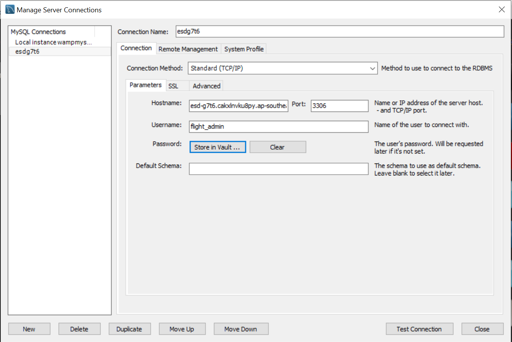
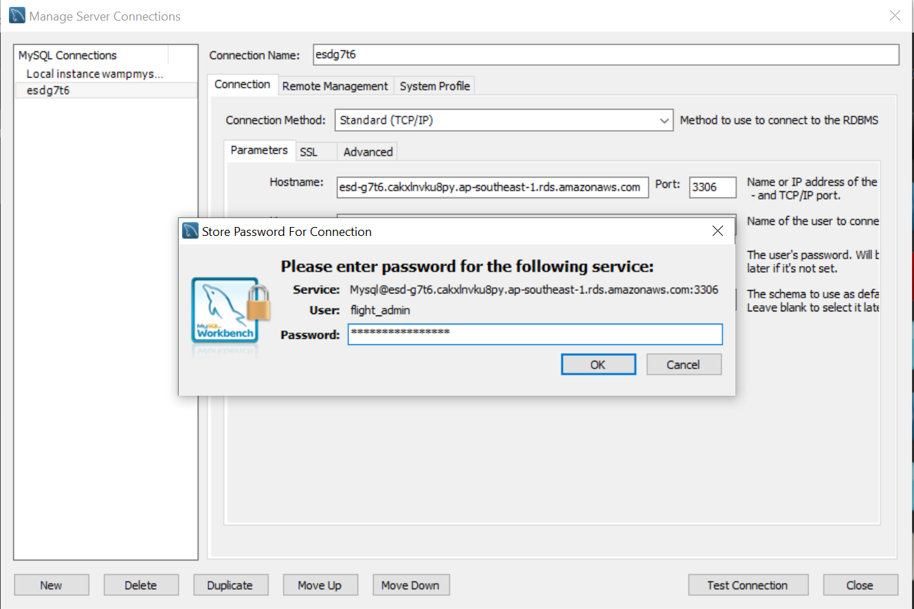
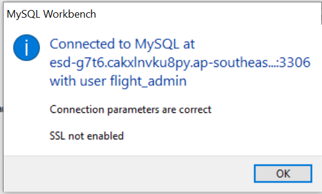

# Airline Enterprise Solution


Our airline enterprise solution provides flight services that can be accessed through a streamlined online booking system. The microservices under our enterprise solution are Pricing, Billing, Passengers, Flight, App, Booking and Notification.

## Prerequisites
We have built requirements.txt that includes the required Python libraries to be installed. In command prompt, navigate to flightapp directory and run the folowing command to install all dependencies in our enterprise solution.

```
pip3 install -r requirements.txt
```

Also, ensures that MySQL workbench in installed in your local computer.

## Access to database
The databases of microservices are set up with AWS Relational Database Service (RDS). In order to access the databases: 
1. Launch MySQL Workbench. Click on the Database tab, followed by Manage Connections.
2. Add a new connection. Key in the host name, username and your preferred connection name respectively.

    Host Name: esd-g7t6.cakxlnvku8py.ap-southeast-1.rds.amazonaws.com

	Username: flight_admin

	

3. Click on Store in vault and key in the password for the database. 

   Password: 6kKVm7C2PHtVtgGT

	

4. Click OK and test connection. The following message will appear if the database is successfully connected. 


	

## Run Microservices with Dockers
The 6 microservices, including App, Pricing, Flight, Passenger, Booking and Billing are encapsulated in Docker containers. We have built and pushed the 6 docker images on Docker Hub at [here](https://hub.docker.com/r/vptv1310/flightapp). The microservices will be run on the local host. They can be pulled by using this command: 
```
docker pull vptv1310/flightapp
```

### Docker Compose
For ease of convenience, we have also leveraged on Docker Compose to deploy multiple microservices docker container at once with a single command.

We have built the docker-compose.yml file. In comand prompt, navigate to the flightapp directory and simply execute this command:

```
docker-compose up
```

## Access to Frontend UI
We make use of Jinja, a web template engine, to render the frontend web pages. 

For a complete user process to create and manage bookings, user begins by accessing the [Homepage](http://0.0.0.0:8000/about) where they can create an account or login to access the other services and webpages.

All our frontend webpages can also be accessed via these links:
* Homepage : http://0.0.0.0:8000/about
* Login page: http://0.0.0.0:8000/login
* Create Account page: http://0.0.0.0:8000/create_account
* Offline check-in page for flight admins: http://0.0.0.0:8000/admin_search
* Cart page that shows the booking passenger chose: http://0.0.0.0:8000/cart
* Manage booking page to view bookings and check-in online: http://0.0.0.0:8000/manage_booking
* Search flights page to select desired flights, dates and add-ons: http://0.0.0.0:8000/search_flights.html
* Payment page via paypal: http://0.0.0.0:8000/paypal


## Authors
* Bak Ing Sin @ingsin.bak.2017@sis.smu.edu.sg
* Bui Phuong Thao @ptvvo.2018@sis.smu.edu.sg
* Vo Pham Thao Vi @ptbui.2018@sis.smu.edu.sg  
* Loh Xiao Bing @xbloh.2018@sis.smu.edu.sg  
* Teo Jia Cheng @jcteo.2018@sis.smu.edu.sg

## Acknowlegement
* Professor: Alan Megargel
* Instructor: Ong Hong Seng
* Teaching Assistant: Chye Soon Hang 